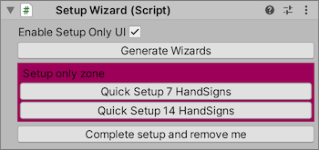
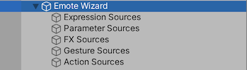

## Emote Wizardのセットアップ

`Setup Wizard` からEmote Wizardの各コンポーネントを生成できます。
コンポーネントは全て生成することを推奨しますが、例えばGesture Layerを使わない場合にGesture Wizardを使わないなどのカスタマイズは可能です。

Setup Wizard は以下のコンポーネントを生成します。

- `Wizard` ウィザード。出力するAnimator Controllerや Expressionアセットの全体的な設定。
- `Data Source` データソース。ここで設定した個々のメニュー項目や表情、着せ替えなどの設定が出力するアセットに追加されます。

こだわりがなければ、 `Quick Setup 7 HandSigns` をクリックしてコンポーネントを生成したのち、 `Complete Setup and Remove Me` をクリックしてSetup Wizardを削除して [次のステップ](3_AvatarSettings.md) に進んでください。

### Setup Wizard

標準のセットアップを行った場合、ヒエラルキーの構造は以下のようになります。
データソースはカテゴリごとに分類されてデフォルト値が設定されます。

#### 一般設定

- `Enable Setup Only UI`: オンにした場合、各コンポーネントのSetup only zoneが有効になります。Setup only zone内のボタンはコンポーネントの設定済みデータを全て初期化するため、注意して扱ってください。
- `Generate Wizards`: 全てのウィザードを中身が空の状態で生成します。

#### Setup only zone

- `Quick Setup 7 HandSigns`: 全てのウィザードを生成し、デフォルトのデータソースを追加します。
- `Quick Setup 14 HandSigns`: 全てのコンポーネントを生成し、デフォルトのデータソースを追加します。
- `Complete Setup and Remove Me`: Setup Wizardを削除します。Setup Wizard自体はアバターの設定を保持しないため、必要になった時点で再度追加できます。

### HandSignsの選び方

- 左手と右手のハンドサインに同一の表情を設定する
  - `7 HandSigns` を選んでください。
- 左手と右手のハンドサインに別々の表情を設定する
  - `7 HandSigns` を選んだ上で、 `Advanced Animations` を有効にしてください。
- 左手と右手で同じハンドサインを出した場合に、特別な表情が出るようにする
  - `14 HandSigns` を選んでください。

