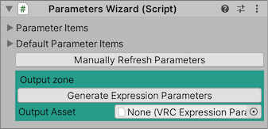
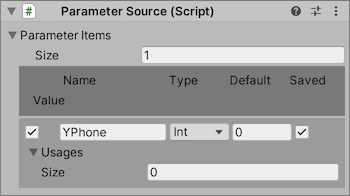

## Expression Parametersの設定

`Parameters Wizard` はアバターのExpression Parameterを管理します。
必要に応じて自動で更新されるため、通常は触る必要がありません。
外部のアセットが必要とするパラメータが存在する場合、 `Parameter Source` に登録することで追加パラメータを出力されるExpression Parameterにマージできます。

外部アセットを利用していなければ、何もせずに [次のステップ](6_FxAndGestures.md) に進んでください。

### Parameters Wizard

- `Parameter Items`: Emote Wizardの管理下にあるパラメータを確認できます。編集はできません。
- `Default Parameter Items`: VRCSDKが標準で提供するパラメータを確認できます。編集はできません。
- `Manually Collect Parameters`: パラメータを手動更新します。

#### Output zone

- `Generate Expression Parameters` Expression Parametersアセットを生成します。
- `Output Asset` 生成されたExpression Parametersアセットがここにセットされます。

### Parameter Source

アバターに追加するパラメータをここに登録します。

#### 各アイテム

- `✔︎`: オフにした場合、パラメータは生成されません。
- `Icon`: パラメータの名前
- `Type`: パラメータタイプ。
  - `Auto`: Usages に基づいて自動判定されます。
  - `Int`: `Int` 型のパラメータ
  - `Bool`: `Bool` 型のパラメータ
  - `Float`: `Float` 型のパラメータ
- `Default`: パラメータのデフォルト値
- `Saved`: パラメータがインスタンス移動をまたいで保存されるか？
- `Usages`: Expressions Wizardでパラメータが利用されている場合、ここに表示されます。

