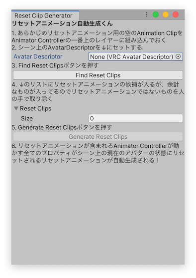

# リセットアニメーション自動生成くん ドキュメント

メニューバーの `Window` → `Silksprite` → `Reset Clip Generator` から、**リセットアニメーション自動生成くん**を呼び出すことができます。

要は [プラナリアさんのブログ](https://inplanaria.hatenablog.com/entry/2021/10/19/173217) の「デフォルト表情アニメーション」を自動生成するツールです。

表情アニメーションでどのブレンドシェイプを使ってたか忘れてももう大丈夫！

## 使い方

ウィンドウに書かれている指示に従ってください。

※4. の手順ではリセットアニメーションではないAnimation Clipを人の手で取り除く必要がありますが、とりあえず `None` にしておけば大丈夫です。

## インストール方法

https://raw.githubusercontent.com/kaikoga/EasyModeAvatar-Unity/develop/EasyModeAvatar/Assets/ResetClipGenerator/Editor/ResetClipGenerator.cs を保存して、 `Assets` の中に適当な `Editor` フォルダがなければ作った上で突っ込む

# おつかれさまでした。
