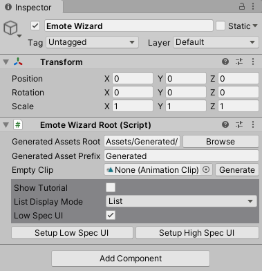

## Emote Wizardの基本設定

ヒエラルキー上を右クリック、またはメニューバーの `GameObject` → `Emote Wizard` で、ヒエラルキー上に `Emote Wizard` という名前のGameObjectが追加されます。
Emote Wizardを利用したアバターセットアップは、基本的に全てこのGameObjectを選択した状態でインスペクタから行うこととなります。

Emote Wizardで行った設定の内容がアバターに直接組み込まれることはありません。
Emote Wizardで設定を行ってから、設定内容をアバターに反映するという手順を踏みます。

細かなカスタマイズが不要な場合は、 `Emote Wizard Root` コンポーネントの `Setup High Spec UI` をクリックして [次のステップ](2_SetupWizard.md) に進んでください。

### インスペクタ

#### 一般設定

- `Generated Assets Root`: Emote Wizardが自動生成するアセットの保存先ディレクトリを指定します。
- `Generated Assets Prefix`: Emote Wizardが自動生成するアセットの名前の先頭につける文字列を指定します。
- `Empty Clip`: ここにセットされたアニメーションクリップが各所で「空のアニメーション」として使用されます。必要に応じて自動生成されますので、編集の必要はありません。

#### 各種設定

- `Show Tutorial`: 日本語の簡易説明を表示します。
- `List Display Mode`: リスト表示の項目数が多い場合に、表示方法を３タイプから変更することができます。Emote Wizardの全てのコンポーネントに対して有効です。
- `Low Spec UI`: オンにした場合、各コンポーネントごとにGameObjectが分割されるようになります。（インスペクタの縦スクロールが減るため、多少軽くなります）`Setup Low Spec UI` をクリックしてセットアップを開始した場合、Low Spec UIは自動でオンになります。

