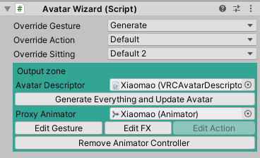

## アバターの設定 

`Avatar Wizard` では操作対象のアバターを選択します。
最低限 `Avatar Descriptor` だけセットして [次のステップ](4_Expressions.md) に進んでください。

### Avatar Wizard

#### 一般設定

- `Override Gesture`: Gestureレイヤーのコントローラーを選択できます。
- `Override Action`: Gestureレイヤーのコントローラーを選択できます。
- `Override Sitting`: Gestureレイヤーのコントローラーを選択できます。

#### Output zone

- `Avatar Descriptor`: Gestureレイヤーのコントローラーを選択できます。
- `Generate Everything and Update Avatar`: 全てのセットアップを実行します。
- `Proxy Animator`: アップロードするアバターを直接編集せず、別のGameObjectでアニメーションや表情の設定を行いたい場合、ここにセットしてください。ここが空の場合は `Avatar Descriptor` にセットされたAnimatorが以下のアニメーション編集用ボタンで使われます。
- `Edit Gesture`: アニメーションを編集するために、 Animator に Gesture レイヤーのAnimator Controllerを一時的に設定します。
- `Edit FX`: （同上） FX レイヤーのAnimator Controllerを一時的に設定します。
- `Edit Action`: （同上）Action レイヤーのAnimator Controllerを一時的に設定します。
- `Remove Animator Controller`: 上記のボタンで設定されたAnimator Controllerを取り除きます。
