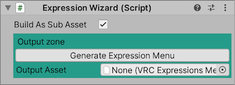

## Expression Wizard

`Expression Wizard` ではExpression Menuを編集します。
Emote Wizardは最初にメニュー項目を作ってから、メニュー項目に対応するパラメータとアニメーションを設定する順番で作業することを想定しています。

Expression Menuを編集する必要がなければ、何もせずに [次のステップ](5_ParametersWizard.md) に進んでください。

### インスペクタ

#### 各アイテム

- `✔︎`: オフにした場合、メニュー項目は生成されません。
- `Icon`: メニュー項目に設定するアイコン。
- `Path`: メニュー項目の配置先。スラッシュ区切りで、サブメニューを指定できます。
- `Parameter`: メニュー項目に対応するパラメータ。（空白で、パラメータ未設定）
- `Value`: メニュー項目を選択した場合にパラメータにセットされる値。
- `ControlType`: メニュー項目のタイプ。選択内容次第で、追加の設定項目が表示されます。

#### 全体的な設定

- `Build as Sub Asset`: オンにした場合、生成されるExpressionMenuアセットが１ファイルにまとまります。
- `Defualt Prefix`: デフォルトのエモート用メニュー項目を生成する際の配置先を設定します。
- `Populate Default Expression Items`: デフォルトのエモート用メニュー項目を生成します。
- `Group by Folder`: 同じサブフォルダに属するメニュー項目をまとめます。

#### Output zone

- `Generate Expression Menu` Expression Menuアセットを生成します。
- `Output Asset` 生成されたExpression Menuアセットがここにセットされます。
