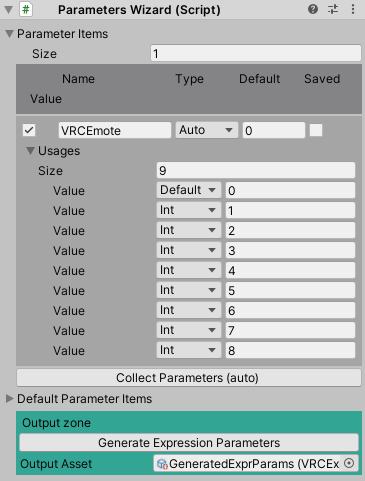

## Parameters Wizard

`Parameters Wizard` はアバターのExpression Parameterを管理します。
必要に応じて自動で更新されます。

外部アセットを利用していなければ、何もせずに [次のステップ](6_FxWizard.md) に進んでください。

### インスペクタ

- `Parameter Items`: Expressions Wizardで利用されているパラメータと、外部アセットで利用するパラメータをここで設定します。
- `Collect Parameters`: Expressions Wizardで利用されているパラメータをParameters Wizardに手動で読み込みます。
- `Default Parameter Items`: VRCSDKが標準で提供するパラメータがここにセットされます。編集はできません。

#### 各アイテム

- `✔︎`: オフにした場合、パラメータは生成されません。
- `Icon`: パラメータの名前
- `Path`: パラメータタイプ。
  - `Auto` 
  - `Int`: `Int` 型のパラメータ
  - `Bool`: `Bool` 型のパラメータ
  - `Float`: `Float` 型のパラメータ
- `Default`: パラメータのデフォルト値
- `Saved`: パラメータがインスタンス移動をまたいで保存されるか？
- `Usages`: Expressions Wizardでパラメータが利用されている場合、ここに表示されます。

#### Output zone

- `Generate Expression Parameters` Expression Parametersアセットを生成します。
- `Output Asset` 生成されたExpression Parametersアセットがここにセットされます。
