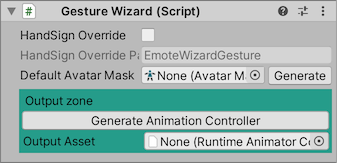
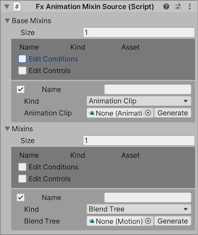

## Fx / Gestureレイヤーの設定

`Fx Wizard` ではFXレイヤーにセットする表情や動的着せ替えアニメーション、 `Gesture Wizard` ではGestureレイヤーにセットするハンドサインアニメーションを設定します。

`Fx Wizard` は以下のデータソースから設定を収集し、マージして Animator Controller を出力します。

- `Fx Emote Source` 表情などの、FX レイヤーでハンドサインに応じて再生されるアニメーション。
- `Fx Parameter Emote Source` 着せ替えなどの、 FX レイヤーで単一のパラメータに連動して表示を変化させるアニメーション。
- `Fx Animation Mixin Source` FX レイヤーで常時再生されるアニメーションや、複数のパラメータに連動するブレンドツリー。

`Gesture Wizard` についても、データソースの名前以外は同様です。

- `Gesture Emote Source` Gesture レイヤーでハンドサインに応じて再生されるアニメーション。
- `Gesture Parameter Emote Source` Gesture レイヤーで単一のパラメータに連動して表示を変化させるアニメーション。
- `Gesture Animation Mixin Source` Gesture レイヤーで常時再生されるアニメーションや、複数のパラメータに連動するブレンドツリー。

最低限 `Fx Emote Source` のHandSign Emoteに表情をセットしたら [次のステップ](7_Actions.md) に進んでください。

### Fx Wizard

#### 全体的な設定

- `HandSign Override` オンにすると、特定のパラメータがセットされている場合に表情固定が有効になります。
- `HandSign Override Parameter`: 表情固定に利用するパラメータ
- `Default Avatar Mask`: Gesture Wizardの場合は、Animator Controllerの各レイヤーにセットするAvatar Maskをここで指定します（省略した場合は、デフォルト値が使用されます）

`HandSign Override Parameter` を有効にした場合、Parameter Wizardにも登録されます。

#### Output zone

- `Generate Animator Controller` Animator Controllerアセットを生成します。
- `Output Asset` 生成されたAnimator Controllerアセットがここにセットされます。
- `Reset Clip` Fx Wizardの場合は、自動生成された表示リセット用のアニメーションがここにセットされます。編集は不要です。

### Fx Emote Source

アバターのハンドサインに連動するアニメーションをここに登録します。

標準のセットアップで 7 HandSigns を選んだ場合、上記の項目が生成されているはずです。

#### 全体的な設定

- `Advanced Animations`: オンにすると、左手と右手のジェスチャーに対して別々のアニメーションを設定することができます。

#### 各アイテム

一部の項目は初期状態では隠されています。表示する項目を切り替えるには、ヘッダーの `Edit Conditions` 、 `Edit Animations` 、 `Edit Controls` を使います。

- `✔︎`: オンにした場合、表情固定用の値を割り当て可能になります。
- `HandSign Override`: 表情固定に利用するパラメータの値
- `Gesture` / `Gesture Other`: ハンドサインの詳細条件
- `Conditions`: アニメーションの再生条件。
- `Clip`: ハンドサインで再生されるアニメーション
- `Clip Left` / `Clip Right`: 左手と右手のハンドサインで再生されるアニメーション（ `Advanced Animations` がオンの場合）
- `Duration`: アニメーションの切り替わりが完了するまでの時間。
- `Normalized Time`: オンにした場合、パラメータによってアニメーションの再生位置を制御します。
  - `Parameter`: `Normalized Time`のパラメータ
- `Tracking Overrides`: このアニメーションを再生中、まばたきやリップシンク、その他のトラッキングを無効にしてアニメーションの動作を再生します。まばたきを固定する際は `Eyes` 、リップシンクを固定する場合は `Mouth` を設定してください。

### Fx Parameter Emote Source

アバターに追加する、Expression Parameterに連動するアニメーションをここに登録します。

#### 各アイテム

一部の項目は初期状態では隠されています。表示する項目を切り替えるには、ヘッダーの `Edit Transition Targets` と `Edit Transition Controls` を使います。（これらの項目は `Emote Kind` が `Transition` の場合のみ表示されます。）

- `✔︎`: オフにした場合、このParameter Emoteはアバターには含まれません。
- `Name`: このParameter Emoteの表示上の名前。この名前はアバターには含まれません。
- `Parameter`: このパラメータに基づいて表示を切り替えます。
- `Emote Kind`: 表示を切り替える方法を選択します。
  - `Unused`: このParameter Emoteを使用しません。
  - `Transition`: ステート遷移を利用して表示を切り替えます。
  - `NormalizedTime`: アニメーションクリップの再生位置をパラメータで制御します。
  - `BlendTree`: 表示を切り替えるためのブレンドツリーを生成します。
- `States`: パラメータの値
- `Targets`: `Transition` を選択した場合、GameObjectの有効・無効を切り替えるアニメーションを自動生成できます。パラメータの値ごとに有効にしたいGameObjectを設定したのち、一番下に表示される `Generate clips from targets` ボタンを押して下さい。

`Collect Parameters` ボタンを押すと、未使用のパラメータに対応するParameter Emoteが生成され、Statesが足りない場合は補完されます。

### Fx Animation Mixin Source

アバターに追加する、常時再生されるアニメーションや複数のパラメータに連動するブレンドツリーをここに登録します。

- `Base Mixins`: Animator Controllerの上のレイヤーに追加されます。これらは他のアニメーションによって上書きされます。
- `Mixins`: Animator Controllerの下のレイヤーに追加されます。これらは他のアニメーションを上書きして再生されます。

#### 各アイテム

一部の項目は初期状態では隠されています。表示する項目を切り替えるには、ヘッダーの `Edit Conditions` と `Edit Controls` を使います。

- `✔︎`: オフにした場合、アニメーションはアバターに含まれません。
- `Name`: Mixinの表示上の名前。この名前はアバターには含まれません。
- `Kind`: Mixinの種類。
- `Conditions`: アニメーションの再生条件。
- `Duration`: アニメーションの切り替わりが完了するまでの時間。
- `Normalized Time`: オンにした場合、パラメータによってアニメーションの再生位置を制御します。
  - `Parameter`: `Normalized Time`のパラメータ
- `Tracking Overrides`: このアニメーションを再生中、まばたきやリップシンク、その他のトラッキングを無効にしてアニメーションの動作を再生します。まばたきを固定する際は `Eyes` 、リップシンクを固定する場合は `Mouth` を設定してください。

