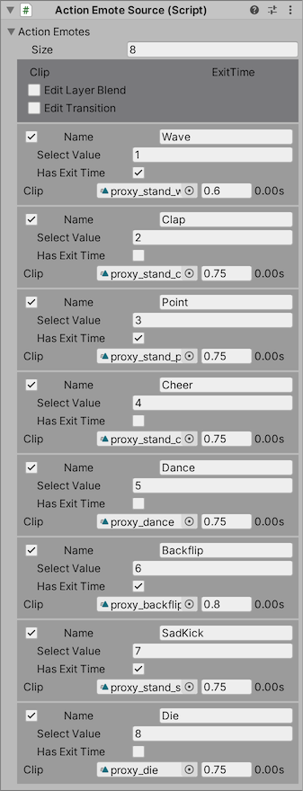
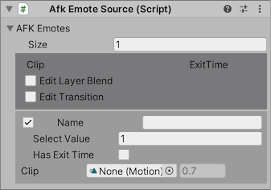

## Actionレイヤーの設定

`Action Wizard` ではActionレイヤーにセットするエモートとAFKアニメーションを設定します。

`Action Wizard` は以下のデータソースから設定を収集し、マージして Animator Controller を出力します。

- `Action Emote Source` Expression Menuから再生するエモートのモーション。
- `AFK Emote Source` カスタム AFK モーション。パラメータに従って AFK モーションをデフォルトのものから切り替えることができます。

凝った改変をしない場合は編集不要です。必要がなければ何もせずに [次のステップ](8_Publish.md)に進んでください。

### Action Wizard

#### 全体的な設定

- `Fixed Transition Duration`: オンにしておいてください。
- `Action Select Parameter` このパラメータが0以外の値になるとエモートが再生されます。
- `Action Emotes` エモートの設定
- `AFK Select Enabled` オンにすると、AFKアニメーションを選択可能になります。
- `AFK Select Parameter` AFKアニメーションを選択するためのパラメータ
- `AFK Emotes`: AFKアニメーションの設定
- `Default AFK Emotes`: デフォルトのAFKアニメーションの設定

`Action Select Parameter` や `AFK Select Parameter` を有効にした場合、Parameter Wizardにも登録されます。

#### Output zone

- `Generate Animator Controller` Animator Controllerアセットを生成します。
- `Output Asset` 生成されたAnimator Controllerアセットがここにセットされます。

### Action Emote Source

アバターに追加する、Expression Menuから再生するエモートをここに登録します。

標準のセットアップを行った場合、上記の項目が生成されているはずです。

### 各アイテム

一部の項目は初期状態では隠されています。表示する項目を切り替えるには、ヘッダーの `Edit Layer Blend` と `Edit Transition` を使います。

VRCSDK 標準のアクションレイヤーを再現する上で設定項目が多くなっているため、詳しい説明は省略します。生成されたAnimator Controllerを見て雰囲気を掴んでください。

### AFK Emote Source

アバターに追加するカスタム AFK モーションをここに登録します。
設定方法はAction Emote Sourceに準じます。