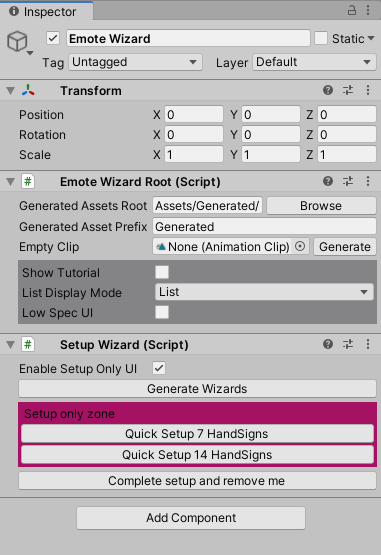
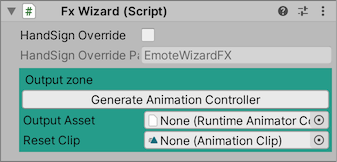
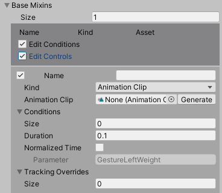
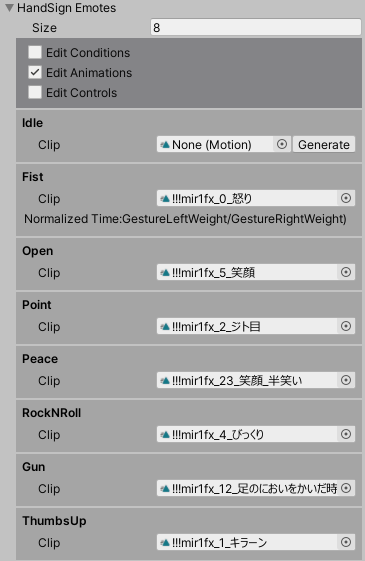
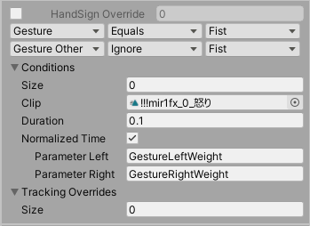
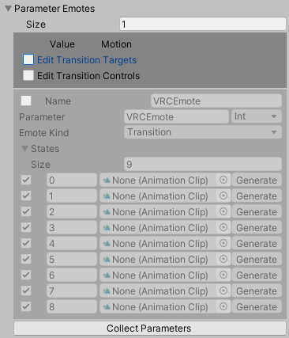
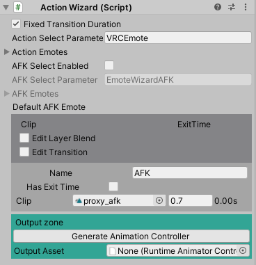
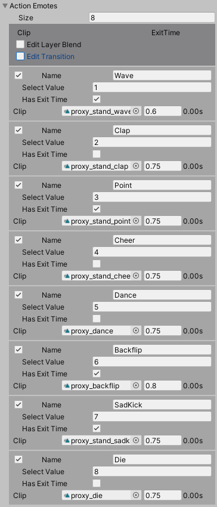
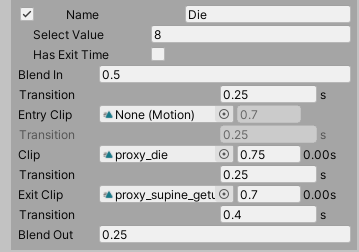

# Emote Wizard 1.0.0 ドキュメント

## これは何？

VRChatのAvatar SDK3.0 用のアバターのセットアップを支援するツールです。
アップロードしているアバターが多い人向け、かつUnityの基本操作とAvatar 3.0の基本がわかってる人向けとなっております。

Emote Wizardは、アバターと同じシーン上に配置することで、アバターの表情や動的な着せ替えアニメーションとExpression Menu・Expression Parameterを一括管理するツールです。

- AvatarDescriptorのベース設定（管轄外！）
- 衣装着せ替え・アクセサリ着脱・テクスチャ編集（管轄外！）
- **表情編集・動的な着せ替えアニメーション（Emote Wizardはここを担当）**

Emote Wizardは、Avatar SDK 3.0用のVRCAvatarDescriptorのうち、以下の設定を占有します。

- Playable Layers
  - Gesture Layer
  - Action Layer
  - FX Layer
  - Sitting Layer
- Expressions
  - Expression Menu
  - Expression Parameter

これ以外の設定はEmote Wizardからは利用することができませんので、必要に応じてUnityやVRCSDK標準の機能でセットアップを行うか、他のツールと併用してください。

### 動作環境

Emote Wizard 1.0.0 は以下の環境で動作を確認しています。

- Windows 10
- Unity2019.4.29f1
- VRCSDK3-AVATAR-2021.08.04.11.23_Public

これ以外の環境でも動作するかもしれませんが、自己責任でお願いします。
また、上記の環境を満たしている場合も、動作保証や他のツールとの相性などのサポート対応は致しかねる場合があります。ご了承ください。

### 利用条件

本ソフトウェアは MIT License にて配布いたします。私的利用を超えた範囲で利用または再配布を行う場合は、 MIT License の条件に従ってください。
正式なライセンス文書は LICENSE.md を参照してください。

また、kaikogaは、Emote Wizardの正常動作に関して一切の保障をいたしません。このドキュメントではUnityの基本操作も特に説明はいたしません。

### 内部仕様

以下の仕様が干渉する場合は、他のツールと併用することができません。

**Emote WizardはAnimator Controllerを自動生成します。** 独自のAnimator Controllerを提供するアバターや、Animator Controllerのステートマシンを編集して機能を追加するタイプのツールとは相性が良くないと思います。

**Emote WizardはExpression Menu、Expression Parameterを自動生成します。** 全てのアニメーションパラメータはEmote Wizardで管理する必要があります。他のアセットで利用するパラメータはParameter Wizardなどから設定することもできますが、上級者向けとなります。

**Expression Menuの項目名をスラッシュ区切りで入力することによって、自動的にサブフォルダが作成されます。** 

**アニメーションのWrite Defaultsはオフとなります。** Emote Wizardは、Write Defaultsがオフの状態で再生終了したアニメーションのシェイプキーが元の値に戻るように、リセット用のアニメーションクリップを自動生成します。これにはAvatar Wizardにセットしたアバターの現在の値が使われます。

例１：
- シーン上でシェイプキーの値が0
- 表情アニメーションによってシェイプキーの値を50に変更
- 表情アニメーション終了時、シェイプキーの値は0に戻る

例２：
- シーン上で服を着ている（GameObjectがアクティブ）
- 着せ替えトグルアニメーションによって服を脱ぐ（GameObjectがアクティブではなくなる）
- 着せ替えトグルアニメーション終了時、GameObjectはアクティブに戻る

**アニメーションのVRCAnimatorTrackingControlはEmote Wizardが管理します。** いわゆるまばたき固定・リップシンク固定に相当する機能です。Tracking Overrideが有効なアニメーションを再生中は `Animation` にセットされ、再生完了すると `Tracking` に戻るようにアニメーションが構築されます。これは完璧ではないので、複数のレイヤーで同じ部位に対してTracking Overrideを設定した場合、固定が意図せず解除される場合があります。 **特に、Action Layerにセットされるエモートは `Eyes` と `Mouth` 以外の全てのトラッキングを固定し、再生完了後に解除します。** このため、Tracking Overrideについて `Eyes` と `Mouth` 以外の設定は可能ですが、推奨されません。

## Emote Wizardの基本設定

ヒエラルキー上を右クリック、または `GameObject` → `Emote Wizard` で、ヒエラルキー上に `Emote Wizard` という名前のGameObjectが追加されます。
Emote Wizardを利用したアバターセットアップは、基本的に全てこのGameObjectを選択した状態でインスペクタから行うこととなります。

細かなカスタマイズが不要な場合は、 `Emote Wizard Root` コンポーネントの `Setup High Spec UI` をクリックして次のステップに進んでください。

### インスペクタ

#### 一般設定

- `Generated Assets Root`: Emote Wizardが自動生成するアセットの保存先ディレクトリを指定します。
- `Generated Assets Prefix`: Emote Wizardが自動生成するアセットの名前の先頭につける文字列を指定します。
- `Empty Clip`: ここにセットされたアニメーションクリップが各所で「空のアニメーション」として使用されます。必要に応じて自動生成されますので、編集の必要はありません。

#### 各種設定

- `Show Tutorial`: 日本語の簡易説明を表示します。
- `List Display Mode`: リスト表示の項目数が多い場合に、表示方法を３タイプから変更することができます。Emote Wizardの全てのコンポーネントに対して有効です。
- `Low Spec UI`: オンにした場合、各コンポーネントごとにGameObjectが分割されるようになります。（インスペクタの縦スクロールが減るため、多少軽くなります）`Setup Low Spec UI` をクリックしてセットアップを開始した場合、Low Spec UIは自動でオンになります。

## セットアップ

`Setup Wizard` からEmote Wizardの各コンポーネントを生成できます。
コンポーネントは全て生成することを推奨しますが、例えばGesture Layerを使わない場合にGesture Wizardを使わないなどのカスタマイズは可能です。

`Quick Setup 7 HandSigns` をクリックしてコンポーネントを生成したのち、 `Complete Setup and Remove Me` をクリックしてSetup Wizardを削除して次のステップに進んでください。

### インスペクタ

#### 一般設定

- `Enable Setup Only UI`: オンにした場合、各コンポーネントのSetup only zoneが有効になります。Setup only zone内のボタンはコンポーネントの設定済みデータを全て初期化するため、注意して扱ってください。
- `Generate Wizards`: 全てのコンポーネントを中身が空の状態で生成します。

#### Setup only zone

- `Quick Setup 7 HandSigns`: 全てのコンポーネントを生成して初期化します。
- `Quick Setup 14 HandSigns`: 全てのコンポーネントを生成して初期化します。
- `Complete Setup and Remove Me`: Setup Wizardを削除することができます。（必要になった時点で再度追加できます）

### HandSignsの選び方

以下の方は、 `7 HandSigns` を選んでください。

- 左手と右手のハンドサインに同一の表情を設定する
- 左手と右手のハンドサインに別々の表情を設定する

以下の方は、 `14 HandSigns` を選んでください。

- 左手と右手で同じハンドサインを出した場合に、特別な表情が出るようにする

## Avatar Wizard

`Avatar Wizard` ではセットアップ対象のアバターの基本情報を設定します。
最低限 `Avatar Descriptor` だけセットして次のステップに進んでください。

### インスペクタ

#### 一般設定

- `Override Gesture`: Gestureレイヤーのコントローラーを選択できます。
- `Override Action`: Gestureレイヤーのコントローラーを選択できます。
- `Override Sitting`: Gestureレイヤーのコントローラーを選択できます。

#### Output zone

- `Avatar Descriptor`: Gestureレイヤーのコントローラーを選択できます。
- `Generate Everything and Update Avatar`: 全てのセットアップを実行します。
- `Proxy Animator`: アップロードするアバターを直接編集せず、別のGameObjectでアニメーションや表情の設定を行いたい場合、ここにセットしてください。ここが空の場合は `Avatar Descriptor` にセットされたAnimatorが以下のアニメーション編集用ボタンで使われます。
- `Edit Gesture`: アニメーションを編集するために、 Animator に Gesture レイヤーのAnimator Controllerを一時的に設定します。
- `Edit FX`: （同上） FX レイヤーのAnimator Controllerを一時的に設定します。
- `Edit Action`: （同上）Action レイヤーのAnimator Controllerを一時的に設定します。
- `Remove Animator Controller`: 上記のボタンで設定されたAnimator Controllerを取り除きます。

## Expression Wizard

`Expression Wizard` ではExpression Menuを編集します。
Emote Wizardは最初にメニュー項目を作ってから、メニュー項目に対応するパラメータとアニメーションを設定する順番でアバターを作ります。

Expression Menuを編集する必要がなければ、何もせずに次のステップに進んでください。

### インスペクタ

#### 各アイテム

- `✔︎`: オフにした場合、メニュー項目は生成されません。
- `Icon`: メニュー項目に設定するアイコン。
- `Path`: メニュー項目の配置先。スラッシュ区切りで、サブメニューを指定できます。
- `Parameter`: メニュー項目に対応するパラメータ。（空白で、パラメータ未設定）
- `Value`: メニュー項目を選択した場合にパラメータにセットされる値。
- `ControlType`: メニュー項目のタイプ。選択内容次第で、追加の設定項目が表示されます。

#### 全体的な設定

- `Build as Sub Asset`: オンにした場合、生成されるExpressionMenuアセットが１ファイルにまとまります。
- `Defualt Prefix`: デフォルトのエモート用メニュー項目を生成する際の配置先を設定します。
- `Populate Default Expression Items`: デフォルトのエモート用メニュー項目を生成します。
- `Group by Folder`: 同じサブフォルダに属するメニュー項目をまとめます。

#### Output zone

- `Generate Expression Menu` Expression Menuアセットを生成します。
- `Output Asset` 生成されたExpression Menuアセットがここにセットされます。

## Parameters Wizard

`Parameters Wizard` はアバターのExpression Parameterを管理します。
必要に応じて自動で更新されます。

外部アセットを利用していなければ、何もせずに次のステップに進んでください。

### インスペクタ

- `Parameter Items`: Expressions Wizardで利用されているパラメータと、外部アセットで利用するパラメータをここで設定します。
- `Collect Parameters`: Expressions Wizardで利用されているパラメータをParameters Wizardに手動で読み込みます。
- `Default Parameter Items`: VRCSDKが標準で提供するパラメータがここにセットされます。編集はできません。

#### 各アイテム

- `✔︎`: オフにした場合、パラメータは生成されません。
- `Icon`: パラメータの名前
- `Path`: パラメータタイプ。
  - `Auto` 
  - `Int`: `Int` 型のパラメータ
  - `Bool`: `Bool` 型のパラメータ
  - `Float`: `Float` 型のパラメータ
- `Default`: パラメータのデフォルト値
- `Saved`: パラメータがインスタンス移動をまたいで保存されるか？
- `Usages`: Expressions Wizardでパラメータが利用されている場合、ここに表示されます。

#### Output zone

- `Generate Expression Parameters` Expression Parametersアセットを生成します。
- `Output Asset` 生成されたExpression Parametersアセットがここにセットされます。

## Fx Wizard / Gesture Wizard

`Fx Wizard` ではFXレイヤーにセットする表情や動的着せ替えアニメーション、 `Gesture Wizard` ではGestureレイヤーにセットするハンドサインアニメーションを設定します。

最低限Fx WizardのHandSign Emoteに表情をセットしたら次のステップに進んでください。

### インスペクタ

#### 全体的な設定

- `Advanced Animations`: オンにすると、左手と右手のジェスチャーに対して別々のアニメーションを設定することができます。
- `HandSign Override` オンにすると、特定のパラメータがセットされている場合は表情固定が有効になります。
- `HandSign Override Parameter`: 表情固定に利用するパラメータ

#### 個別のアニメーション設定

Emote Wizard のアニメーションは大きく４つのカテゴリに分かれています。
アニメーションの再生条件に適切な設定項目を利用してください。

- `Base Mixin`: 常時再生のアニメーション。他のアニメーションよりも前に適用されます（優先度が低い）
- `HandSign Emote`: ハンドサインに応じて再生されるアニメーション。
- `Parameter Emote`: 単一のパラメータに連動して表示を変化させるアニメーション。
- `Mixin`: 常時再生のアニメーション。他のアニメーションよりも後に適用されます（優先度が高い）
  複数のパラメータに連動して表示を変化させたい場合は、BlendTreeをMixinに組み込んでください。

#### Output zone

- `Generate Animation Controller` Animation Controllerアセットを生成します。
- `Output Asset` 生成されたAnimation Controllerアセットがここにセットされます。
- `Reset Clip` Fx Wizardの場合は、自動生成された表示リセット用のアニメーションがここにセットされます。編集は不要です。

### Base Mixin、Mixin

一部の項目は初期状態では隠されています。全ての項目を表示するためには、ヘッダーの `Edit Conditions` ならびに `Edit Controls` をオンにしてください。

- `✔︎`: オフにした場合、アニメーションはアバターに含まれません。
- `Name`: Mixinの表示上の名前。この名前はアバターには含まれません。
- `Kind`: Mixinの種類。
- `Conditions`: アニメーションの再生条件。
- `Duration`: アニメーションの切り替わりが完了するまでの時間。
- `Normalized Time`: オンにした場合、パラメータによってアニメーションの再生位置を制御します。
  - `Parameter`: `Normalized Time`のパラメータ
- `Tracking Overrides`: このアニメーションを再生中、まばたきやリップシンク、その他のトラッキングを無効にしてアニメーションの動作を再生します。まばたきを固定する際は `Eyes` 、リップシンクを固定する場合は `Mouth` を設定してください。

### HandSign Emote

標準のセットアップで 7 HandSigns を選んだ場合、上記の項目が生成されているはずです。

一部の項目は初期状態では隠されています。全ての項目を表示するためには、ヘッダーの `Edit Conditions` 、 `Edit Animations` ならびに `Edit Controls` をオンにしてください。

- `✔︎`: オンにした場合、表情固定用の値を割り当て可能になります。
- `HandSign Override`: 表情固定に利用するパラメータの値
- `Gesture` / `Gesture Other`: ハンドサインの詳細条件
- `Conditions`: アニメーションの再生条件。
- `Clip`: ハンドサインで再生されるアニメーション
- `Clip Left` / `Clip Right`: 左手と右手のハンドサインで再生されるアニメーション
- `Duration`: アニメーションの切り替わりが完了するまでの時間。
- `Normalized Time`: オンにした場合、パラメータによってアニメーションの再生位置を制御します。
  - `Parameter`: `Normalized Time`のパラメータ
- `Tracking Overrides`: このアニメーションを再生中、まばたきやリップシンク、その他のトラッキングを無効にしてアニメーションの動作を再生します。まばたきを固定する際は `Eyes` 、リップシンクを固定する場合は `Mouth` を設定してください。

### Parameter Emote

一部の項目は初期状態では隠されています。全ての項目を表示するためには、ヘッダーの `Edit Transition Targets` と `Edit Transition Controls` をオンにしてください。（これらの項目は `Emote Kind` が `Transition` の場合のみ表示されます。）

- `✔︎`: オフにした場合、このParameter Emoteはアバターには含まれません。
- `Name`: このParameter Emoteの表示上の名前。この名前はアバターには含まれません。
- `Parameter`: このパラメータに基づいて表示を切り替えます。
- `Emote Kind`: 表示を切り替える方法を選択します。
  - `Unused`: このParameter Emoteを使用しません。
  - `Transition`: ステート遷移を利用して表示を切り替えます。
  - `NormalizedTime`: アニメーションクリップの再生位置をパラメータで制御します。
  - `BlendTree`: 表示を切り替えるためのブレンドツリーを生成します。
- `States`: パラメータの値
- `Targets`: `Transition` を選択した場合、GameObjectの有効・無効を切り替えるアニメーションを自動生成できます。パラメータの値ごとに有効にしたいGameObjectを設定したのち、一番下に表示される `Generate clips from targets` ボタンを押して下さい。

`Collect Parameters` ボタンを押すと、Parameters Wizard上でオンになっている全ての `Parameter Item` と `Default Parameter Item` に対応するParameter Emoteが生成されます。

## Action Wizard

`Action Wizard` ではActionレイヤーにセットするエモートとAFKアニメーションを設定します。

凝った改変をしない場合は編集不要です。必要がなければ何もせずに次のステップに進んでください。

### インスペクタ

#### 全体的な設定

- `Fixed Transition Duration`: オンにしておいてください。
- `Action Select Parameter` このパラメータが0以外の値になるとエモートが再生されます。
- `Action Emotes` エモートの設定
- `AFK Select Enabled` オンにすると、AFKアニメーションを選択可能になります。
- `AFK Select Parameter` AFKアニメーションを選択するためのパラメータ
- `AFK Emotes`: AFKアニメーションの設定
- `Default AFK Emotes`: デフォルトのAFKアニメーションの設定

#### Output zone

- `Generate Animation Controller` Animation Controllerアセットを生成します。
- `Output Asset` 生成されたAnimation Controllerアセットがここにセットされます。

### Action Emote / AFK Emote

標準のセットアップを行った場合、上記の項目が生成されているはずです。

一部の項目は初期状態では隠されています。全ての項目を表示するためには、ヘッダーの `Edit Layer Blend` と `Edit Transition` をオンにしてください。

説明は省略します。生成されたAnimator Controllerを見て雰囲気を掴んでください。

## アバターのビルド

Emote Wizardから行う全ての設定が完了したら、 `Avatar Wizard` の `Generate Everything and Update Avatar` ボタンを押して、設定内容をアバターに反映します。

表情アニメーションを改変したい場合は、ここから `Edit FX` 等のボタンを押して Unity からアニメーションクリップを編集するか、表情改変用の外部ツールを使うことになります。

# おつかれさまでした。
